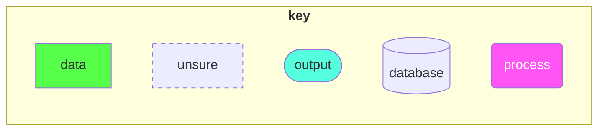
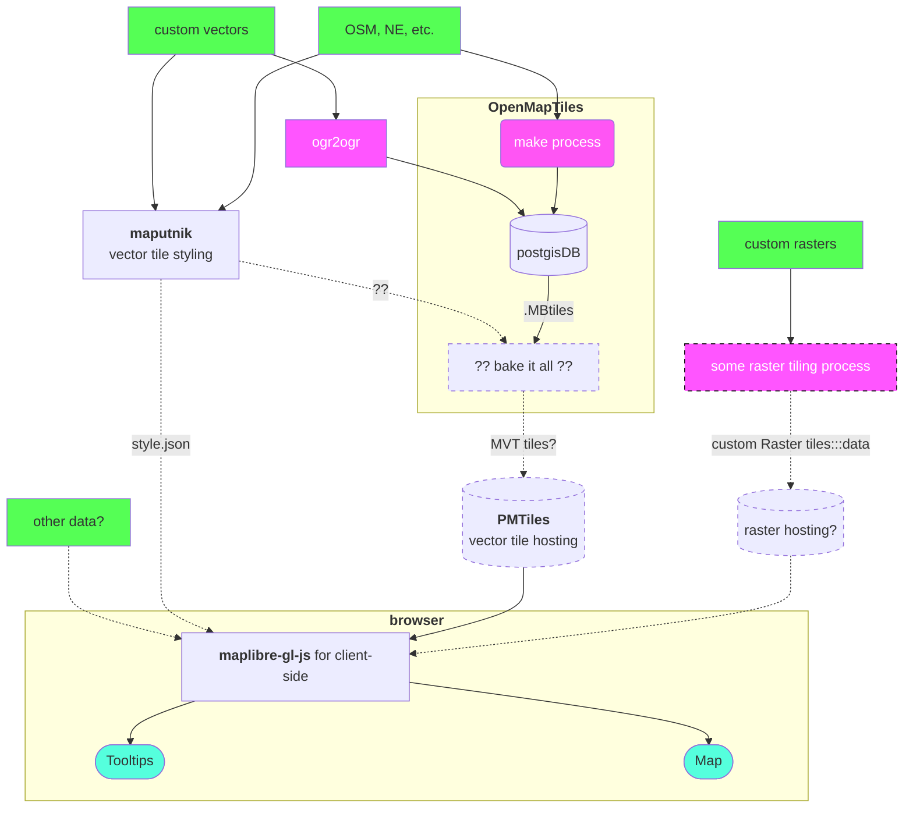

# usda-slippy-map

## Requirements
- [OpenTileMap CLI](https://github.com/openmaptiles/openmaptiles)
- [Maputnik CLI](https://github.com/maplibre/maputnik)
- Probably QGIS3

## Table of Contents

## Rough road map

Trying to follow this: https://www.kschaul.com/post/2023/02/16/how-the-post-is-replacing-mapbox-with-open-source-solutions/

### Todays work
- figure out how to bake the OSM data with custom vector data (finish [this](https://github.com/maptiler/foss4g-workshop?tab=readme-ov-file) tutorial )
- talk over with aly
### Mysteries, as of yet
Basemap
- how big is the basemap in GB? ''
Raster 
- do we even need rasters? Is it possible to create a very very detailed geojson (since it's served as vector tiles)
	- do we have computing power to actually do this transform
		- Could split raster into pieces for RAKM reasons
	- How large would the subsequent file be?
- If not, how to tile-ize rasters (should be existing tech here, i.e. easier) 
- how to serve rasters tiles
- is it possible to serve rasters sandwiched between vector tiles under (borders/lakes), above place labels 
Tooltips
- Where do tooltip data come from? The vector tiles or elsewhere? Probably a maplibre question
Should we include Hawaii and Alaska?
- If so, how are they navigated to in the map? Are we using `900913` mercator? Or other (possible with openmaptile!)
- If so, they will have *more* complicated data...how caveat that 
### To do

Data
- Pre-process 2012 and 2023 data
- Min temp data ?
- Any other data? 

Back end
- Get USA (and alaska/hawaii?) data and build vector tiles
- Tile rasters OR convert to vectors
- style a simple NPR basement
	- learn [style.json syntax](https://docs.mapbox.com/style-spec/guides/) 
	- decide what items are needed
		- state borders
		- oceans
		- major lakes
		- (major?) rivers
		- place names
		- any terrain? 
  - Convert tiles/send tiles to PMTiles
	  - some sort of AWS voodoo

Front end
- Investigate geolocating options
- figure out maplibre GL JS
- figure out tooltips

Design
- all of it

Writing the story
- all of it

Illustrations? 
- all of it

## Flowchart 

## Learn More
### OpenTileMap
- https://github.com/maptiler/foss4g-workshop?tab=readme-ov-file
- https://www.youtube.com/watch?v=mx9l_yn8Dc0&list=PLGHe6Moaz52Mcq4BC9vczIIizNzwIYocv&index=2&ab_channel=MapTiler

### Maputnik
- https://github.com/maplibre/maputnik/wiki/Style-GeoJSON-Files
- style spec: https://docs.mapbox.com/style-spec/guides/
- You may need a maptiler (free) account and API key to use this locally...this is poorly documented: https://cloud.maptiler.com/account/keys/
- You can also use the [web editor](https://maplibre.org/maputnik/?layer=2134303678%7E0#0.49/0/0) but then you can't easily integrate with this repo. 

### How to get Geojsons into postgis/openmaptiles
- https://www.youtube.com/watch?v=3xpTBJAL8nc&list=PLGHe6Moaz52Mcq4BC9vczIIizNzwIYocv&index=4&ab_channel=MapTiler (ogr2ogr)
### Maplibre 
- https://github.com/stlpublicradio/dailygraphics-templates/tree/master/interactive_polygon_map
### Other helpful links
https://discussions.apple.com/docs/DOC-250006086

https://github.com/maplibre/maputnik/issues/215

https://openmaptiles.org/docs/generate/custom-vector-from-shapefile-geojson/